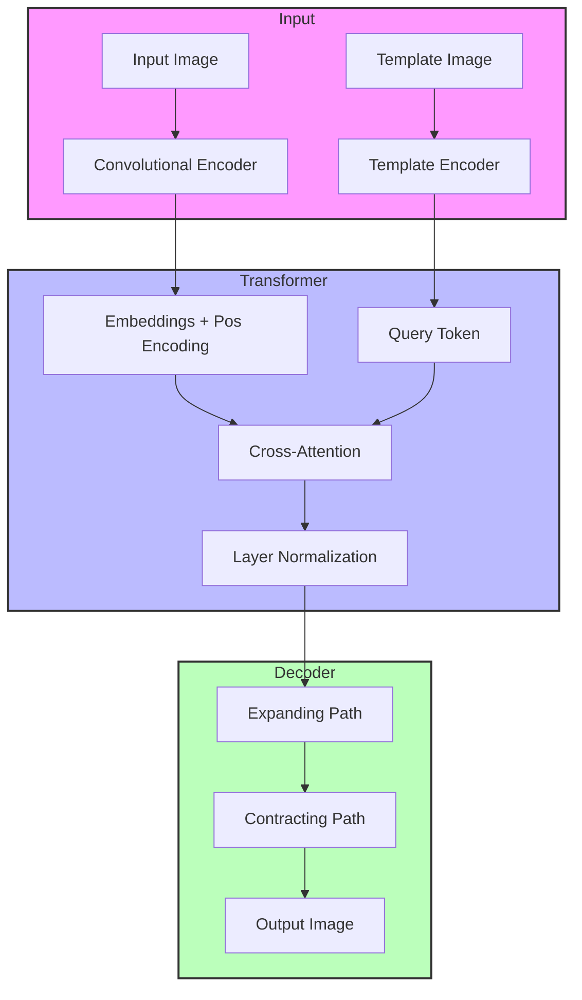

# Novel: Neural Weather Effect Generation Architecture (Updated)

## Architecture Overview



## Model Architecture Details

### 1. Convolutional Encoder

The encoder transforms input images into a sequence of patch embeddings using a hierarchical convolutional architecture:

- **Input**: RGB image (3 channels, 256×256 pixels)
- **Progressive Downsampling**:
  - Initial feature extraction: 3 → embed_dim/4 channels
  - First downsampling (1/2): embed_dim/4 → embed_dim/2 channels
  - Second downsampling (1/4): embed_dim/2 → embed_dim channels
  - Final downsampling (1/16): embed_dim → embed_dim channels
- **Output**: Sequence of patch embeddings [B, N, C]

Mathematical representation of the convolutional encoding process:

$F_{l+1} = \text{GELU}(\text{BN}(\text{Conv}(F_l)))$

where $F_l$ represents features at layer l, BN is batch normalization.

### 2. Cross-Attention Transformer

The transformer processes patch embeddings with cross-attention:

- **Position Encoding**: 2D sinusoidal encoding for image patches
  
  $PE_{(pos,2i)} = \sin(pos/10000^{2i/d_{model}})$
  
  $PE_{(pos,2i+1)} = \cos(pos/10000^{2i/d_{model}})$

- **Cross-Attention**: Multi-head attention where template is used as query and image patches as keys/values

  $\text{Attention}(Q,K,V) = \text{softmax}(\frac{QK^T}{\sqrt{d_k}} + B_{rel})V$

  where $B_{rel}$ is the relative position bias matrix, $Q$ is derived from the template, and $K,V$ are derived from the image patches.

- **Feed-Forward Network**: Two-layer MLP with GELU activation

  $\text{FFN}(x) = \text{Linear}_2(\text{GELU}(\text{Linear}_1(x)))$

### 3. Convolutional Decoder

Progressive upsampling decoder:

- **Expanding Path**: 
  - First expansion (16×16 → 64×64)
  - Second expansion (64×64 → 256×256)
- **Contracting Path**: Final refinement to output channels
- **Residual Connection**: Adds input image for detail preservation

## Key Architectural Changes

1. **Removed Causal Attention**:
   - The previous architecture used causal attention with a mask that prevented tokens from attending to future tokens
   - The new architecture uses standard cross-attention without causal constraints

2. **Template as Query**:
   - Previously: Template was encoded and added as a special token at the end of the sequence
   - Now: Template is encoded and used as the query in cross-attention, while image patches serve as keys and values

3. **Cross-Attention Instead of Self-Attention**:
   - Previously: Self-attention where all tokens (including the template token) attended to each other
   - Now: Cross-attention where the template query attends to image patches

## Training Process

### Dataset Preparation
- Input: Clean images
- Target: Weather-affected images
- Template: Weather pattern template

### Training Algorithm

1. **Initialization**:
   - AdamW optimizer with learning rate 1e-4
   - OneCycleLR scheduler with cosine annealing
   - Mixed precision training (AMP)

2. **Training Loop**:
   ```python
   for epoch in range(num_epochs):
       for clean_imgs, templates, weather_imgs in train_loader:
           # Forward pass with mixed precision
           with autocast():
               outputs = model(clean_imgs, templates)
               loss = criterion(outputs, weather_imgs, templates)
           
           # Backward pass with gradient scaling
           scaler.scale(loss).backward()
           scaler.step(optimizer)
           scaler.update()
           scheduler.step()
   ```

### Loss Functions

The model uses a composite loss function:

$L_{total} = 0.7L_{1} + 0.2L_{structure} + 0.1L_{perceptual}$

where:

1. **Content Loss** ($L_1$):
   $L_1 = \|G(x) - y\|_1$

2. **Structure Loss** ($L_{structure}$):
   $L_{structure} = 1 - \text{SSIM}(G(x), y)$

3. **Perceptual Loss** ($L_{perceptual}$):
   $L_{perceptual} = \text{MSE}(\text{norm}(G(x)), \text{norm}(t))$
   where $t$ is the template image

## Generation Process

1. **Model Loading**:
   - Load trained weights
   - Set model to evaluation mode

2. **Image Processing**:
   ```python
   with torch.no_grad():
       outputs = model(images, templates)
   ```

3. **Post-processing**:
   - Scale outputs to [0, 255]
   - Convert to BGR color space
   - Save generated images

## Usage Example

```python
# Initialize model
model = WeatherTransformer()

# Load pre-trained weights
checkpoint = torch.load('checkpoints/best_model.pth')
model.load_state_dict(checkpoint['model_state_dict'])

# Generate weather effects
with torch.no_grad():
    output = model(input_image, template)
```

## Model Parameters

- Image size: 256×256 pixels
- Embedding dimension: 256
- Number of transformer layers: 4
- Number of attention heads: 8
- MLP ratio: 4
- Patch size: 16×16 pixels
- Dropout rate: 0.1

## Performance Considerations

1. **Memory Efficiency**:
   - Progressive downsampling in encoder
   - Efficient cross-attention implementation
   - Mixed precision training

2. **Training Stability**:
   - Layer normalization before attention
   - Gradient clipping (max norm: 1.0)
   - Learning rate warmup (10% of training)

3. **Quality Improvements**:
   - Template as query provides better control over weather pattern application
   - Cross-attention allows for more direct influence of template on output
   - Removal of causal constraints allows for global pattern application
