# Neural Weather Effect Generation: Transformer Architecture

## Schematic Architecture Overview

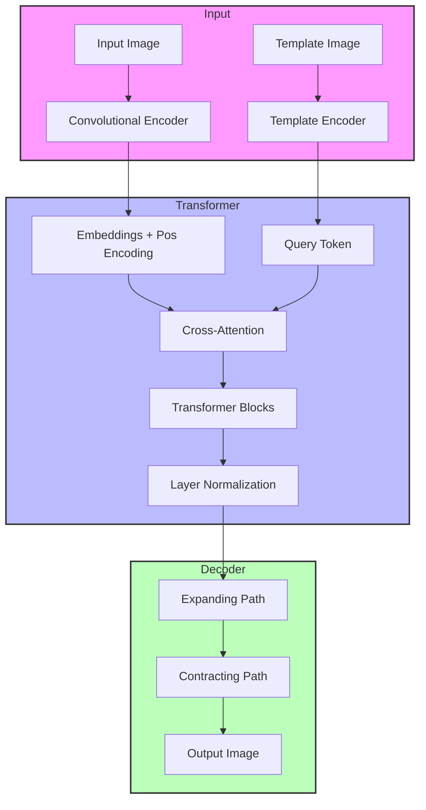

## Detailed Architecture

### 1. Convolutional Encoder

The encoder transforms input images into a sequence of patch embeddings using a hierarchical convolutional architecture:

- **Input**: RGB image (3 channels, 256×256 pixels)
- **Progressive Downsampling**:
  - Initial feature extraction: 3 → embed_dim/4 channels
  - First downsampling (1/2): embed_dim/4 → embed_dim/2 channels
  - Second downsampling (1/4): embed_dim/2 → embed_dim channels
  - Final downsampling (1/16): embed_dim → embed_dim channels
- **Output**: Sequence of patch embeddings [B, N, C]

### 2. Cross-Attention Transformer

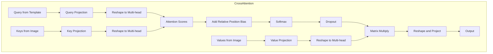

The transformer processes patch embeddings with cross-attention:

- **Position Encoding**: 2D sinusoidal encoding for image patches
- **Cross-Attention**: Multi-head attention where template is used as query and image patches as keys/values
- **Feed-Forward Network**: Two-layer MLP with GELU activation

### 3. Convolutional Decoder

Progressive upsampling decoder:

- **Expanding Path**: 
  - First expansion (16×16 → 64×64)
  - Second expansion (64×64 → 256×256)
- **Contracting Path**: Final refinement to output channels
- **Residual Connection**: Adds input image for detail preservation

## Attention Mechanism: Mathematical Formulation

### 1. Cross-Attention

The core of the transformer architecture is the cross-attention mechanism, which allows the template to attend to relevant parts of the input image:

$$\text{Attention}(Q, K, V) = \text{softmax}\left(\frac{QK^T}{\sqrt{d_k}} + B_{rel}\right)V$$

Where:
- $Q$ is the query matrix derived from the template
- $K$ is the key matrix derived from the image patches
- $V$ is the value matrix derived from the image patches
- $d_k$ is the dimension of the keys
- $B_{rel}$ is the relative position bias matrix

### 2. Multi-Head Attention

The model uses multi-head attention to capture different types of relationships:

$$\text{MultiHead}(Q, K, V) = \text{Concat}(\text{head}_1, \text{head}_2, ..., \text{head}_h)W^O$$

Where each head is computed as:

$$\text{head}_i = \text{Attention}(QW_i^Q, KW_i^K, VW_i^V)$$

- $W_i^Q$, $W_i^K$, $W_i^V$ are parameter matrices for the $i$-th head
- $W^O$ is the output projection matrix

### 3. Position Encoding

The model uses 2D sinusoidal position encoding to provide spatial information:

$$PE_{(pos,2i)} = \sin(pos/10000^{2i/d_{model}})$$
$$PE_{(pos,2i+1)} = \cos(pos/10000^{2i/d_{model}})$$

Where:
- $pos$ is the position
- $i$ is the dimension
- $d_{model}$ is the embedding dimension

### 4. Relative Position Bias

The attention mechanism incorporates a learnable relative position bias:

$$B_{rel} \in \mathbb{R}^{h \times N \times N}$$

Where:
- $h$ is the number of attention heads
- $N$ is the sequence length

This bias is interpolated to match the dimensions of the attention matrix and provides spatial awareness to the attention mechanism.

## Loss Functions

The model uses a composite loss function:

$$L_{total} = 0.7L_{1} + 0.2L_{structure} + 0.1L_{perceptual}$$

Where:

1. **Content Loss** ($L_1$):
   $$L_1 = \|G(x) - y\|_1$$

2. **Structure Loss** ($L_{structure}$):
   $$L_{structure} = 1 - \text{SSIM}(G(x), y)$$

3. **Perceptual Loss** ($L_{perceptual}$):
   $$L_{perceptual} = \text{MSE}(\text{norm}(G(x)), \text{norm}(t))$$
   where $t$ is the template image

## Key Architectural Features

1. **Cross-Attention Mechanism**:
   - Template serves as query, attending to image patches (keys and values)
   - Enables direct control of weather pattern application
   - Allows for global pattern application without causal constraints

2. **Hierarchical Convolutional Encoder**:
   - Progressive downsampling preserves spatial information
   - Efficient feature extraction with reduced parameters
   - Maintains spatial relationships important for weather effects

3. **Progressive Upsampling Decoder**:
   - Gradually reconstructs spatial details
   - Reduces checkerboard artifacts common in transposed convolutions
   - Preserves fine details through residual connection with input image

4. **Position-Aware Attention**:
   - 2D sinusoidal position encoding provides spatial awareness
   - Relative position bias enhances local-global relationships
   - Enables the model to apply weather effects with spatial coherence

## Example Results

The model can generate various weather effects based on the provided template:

### Fog Effect Examples

#### Example 1
| Original Image | Template | Generated Result |
|:---:|:---:|:---:|
|  | 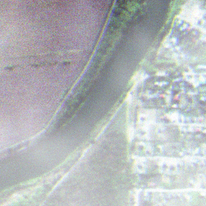 | 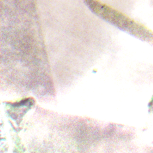 |

#### Example 2
| Original Image | Template | Generated Result |
|:---:|:---:|:---:|
|  | 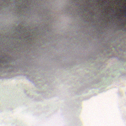 |  |

#### Example 3
| Original Image | Template | Generated Result |
|:---:|:---:|:---:|
|  | 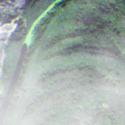 | 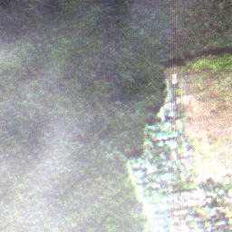 |

### Rain Effect Examples

#### Example 1
| Original Image | Template | Generated Result |
|:---:|:---:|:---:|
|  | 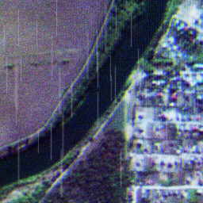 | 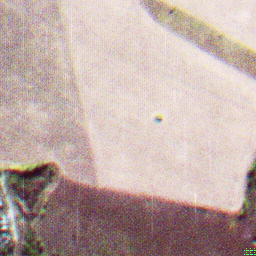 |

#### Example 2
| Original Image | Template | Generated Result |
|:---:|:---:|:---:|
|  | 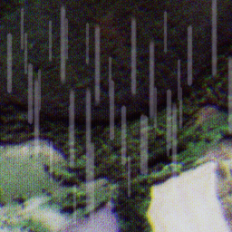 |  |

#### Example 3
| Original Image | Template | Generated Result |
|:---:|:---:|:---:|
| 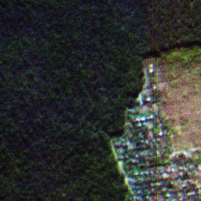 | 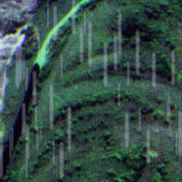 | 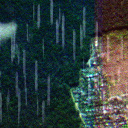 |

### Snow Effect Examples

#### Example 1
| Original Image | Template | Generated Result |
|:---:|:---:|:---:|
|  | 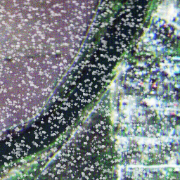 | 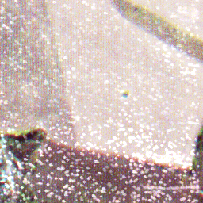 |

#### Example 2
| Original Image | Template | Generated Result |
|:---:|:---:|:---:|
|  | 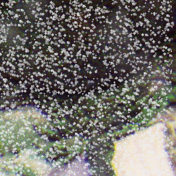 |  |

#### Example 3
| Original Image | Template | Generated Result |
|:---:|:---:|:---:|
|  | 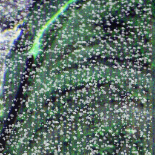 | 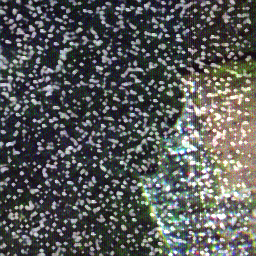 |

## Model Parameters

- Image size: 256×256 pixels
- Embedding dimension: 256
- Number of transformer layers: 4
- Number of attention heads: 8
- MLP ratio: 4
- Patch size: 16×16 pixels
- Dropout rate: 0.1

## Performance Considerations

1. **Memory Efficiency**:
   - Progressive downsampling in encoder
   - Efficient cross-attention implementation
   - Mixed precision training

2. **Training Stability**:
   - Layer normalization before attention
   - Gradient clipping (max norm: 1.0)
   - Learning rate warmup (10% of training)

3. **Quality Improvements**:
   - Template as query provides better control over weather pattern application
   - Cross-attention allows for more direct influence of template on output
   - Removal of causal constraints allows for global pattern application
